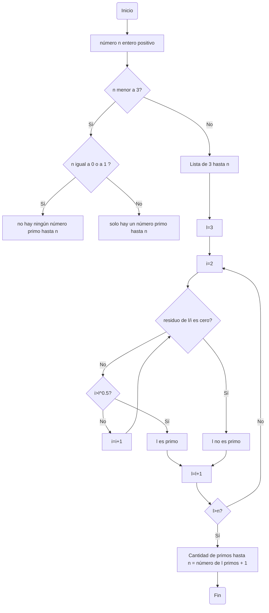

# Reto-3-Flow-en-mis-diagramas

Repositorio en donde se publica la evidencia de que mi persona, Lucas García, cumplió con el reto asignado.

- Y a diferencia del anterior, esta vez no tuve mayores dificultades :) .

## Logo de mi equipo(infaltable):
***

## Algoritmo para obtener números primos hasta N
***
### Diagrama de Flow(Flujo):


### En Pseudocódigo

```pseudocode
[variables]
n : entero
i : entero
l : entero

inicio
  l := 3
  i := 2

  Si n <= 1 entonces
    escribir("no hay números primos hasta n")

  Sino si n == 2 entonces
    escribir("solo hay 1 número primo hasta n")

  sino
    Mientras (l <= n) hacer
      Mientras (i <= l^0.5) hacer
        Si modulo(l,i) == 0 entonces
          escribir("l no es primo")
        sino
          i := i + 1
      Fin mientras
      Si i > l^0.5 entonces 
        escribir("l es primo")
      l := l + 1
    Fin mientras
    Cantidad_de_números_primos_hasta_n := l primos + 1
fin
```
